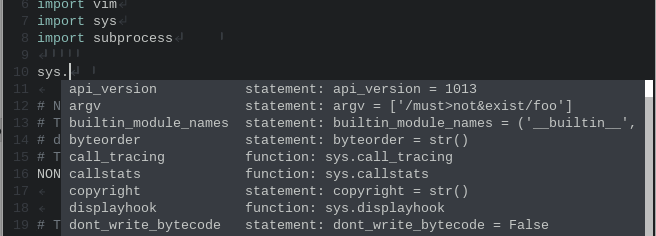

vim-pyenv
===============================================================================
vim-pyenv allows you to activate and deactivate the pyenv Python correctly
in a live Vim session.

[pyenv](https://github.com/yyuu/pyenv) is a simple Python version management
system and users can change the Python versions in a simple way.
However, if you use pyenv to switch the Python version or virtualenv, the
omni-completion would not work correctly.
This is because Vim refers to the system Python and does not know anything
about the pyenv Python, especially the packages you installed on the pyenv
Python.

vim-pyenv activates the pyenv Python and adds the external Python library
search path (PYTHONPATH) to Vim's internal Python PYTHONPATH.
Thus, with vim-pyenv, your [jedi-vim](https://github.com/davidhalter/jedi-vim)
or any kind of Python omni-completion system returns a correct completion list.


Additionally, vim-pyenv supports Vim's dual Python 2 and 3 system.
If your Vim is compiled with +python and +python3, vim-pyenv automatically
synchronizes the Python version to the external Python version.




Documentation
===============================================================================
See `:help vim-pyenv` in Vim.


Installation
===============================================================================
Installing vim-pyenv by using [Neobundle](https://github.com/Shougo/neobundle.vim)
is strongly recommended, because with Neobundle you can specify the
dependencies of the plugins via `depends` options.
The following is an example of Neobundle entry which specifies jedi-vim as a
dependency.

```vim
NeoBundle 'davidhalter/jedi-vim'

" Do not load vim-pyenv until *.py is opened and
" make sure that it is loaded after jedi-vim is loaded.
NeoBundleLazy 'lambdalisue/vim-pyenv', {
        \ 'depends': ['davidhalter/jedi-vim'],
        \ 'autoload': {
        \   'filetypes': ['python', 'python3'],
        \ }}
```

You can use [vundle](https://github.com/gmarik/vundle) or
[pathogen](http://www.vim.org/scripts/script.php?script_id=2332), but make sure
that vim-pyenv is loaded after jedi-vim.


Using vim-pyenv with jedi-vim
==============================================================================

`vim-pyenv-activate-post` and `vim-pyenv-deactivate-post` autocmd can be used
to change the major version of jedi like

```vim
if jedi#init_python()
  function! s:jedi_auto_force_py_version() abort
    let g:jedi#force_py_version = pyenv#python#get_internal_major_version()
  endfunction
  augroup vim-pyenv-custom-augroup
    autocmd! *
    autocmd User vim-pyenv-activate-post   call s:jedi_auto_force_py_version()
    autocmd User vim-pyenv-deactivate-post call s:jedi_auto_force_py_version()
  augroup END
endif
```

The code above automatically call `jedi#force_py_version` every after user change a python version of pyenv via `:PyenvActivate` or `:PyenvDeactivate` command.
