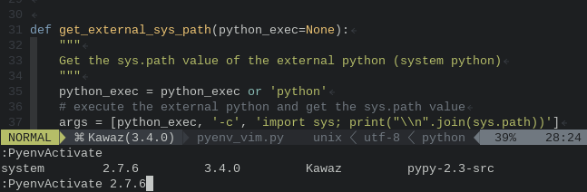

vim-pyenv
===============================================================================
[pyenv](https://github.com/yyuu/pyenv) is a simple python version management
system and users can change the python versions with a quite simple way.
However, if you use pyenv to switch the python version or virtualenv, the
omni-completion would not work correctly.
It is because that the Vim refers the system python and does not know anything
about the pyenv python, especially the packages you installed on the pyenv
python.

*vim-pyenv* allow you to activate and deactivate the pyenv python correctly
in a live Vim session.
It activate the pyenv python and add external python's library searching path
(PYTHONPATH) to the Vim internal python's PYTHONPATH.
Thus, with vim-pyenv, your [jedi-vim](https://github.com/davidhalter/jedi-vim)
or any kind of python omni-completion system returns a correct completion list.



Additionally, vim-pyenv support the python 2 and python 3 dual system.
If your Vim is compiled with +python and +python3, vim-pyenv automatically
synchronize the python version to the external python version.
If you are using jedi-vim, vim-pyenv automatically change the python version
of jedi-vim as well thus omni-completion works in both python 2 and python 3.


Documentation
===============================================================================
See `:help vim-pyenv` on your Vim.


Installation
===============================================================================
Install vim-pyenv by using [neobundle](https://github.com/Shougo/neobundle.vim)
is strongly recommended while neobundle can specify the dependency of the
plugins via `depends` options.
The following is an example of neobundle entry which specify the jedi-vim as a
dependency.

```vim
" do not load jedi-vim until *.py is opend.
NeoBundleLazy 'davidhalter/jedi-vim', {
        \ 'autoload': {
        \   'filetypes': ['python', 'python3'],
        \ }}

" do not load vim-pyenv until *.py is opend and
" make sure that it is loaded after jedi-vim is loaded.
NeoBundleLazy 'lambdalisue/vim-pyenv', {
        \ 'depends': ['davidhalter/jedi-vim'],
        \ 'autoload': {
        \   'filetypes': ['python', 'python3'],
        \ }}
```

You can use [vundle](https://github.com/gmarik/vundle) or 
[pathogen](http://www.vim.org/scripts/script.php?script_id=2332) but make sure
that the vim-pyenv is loaded after the jedi-vim is loaded.
